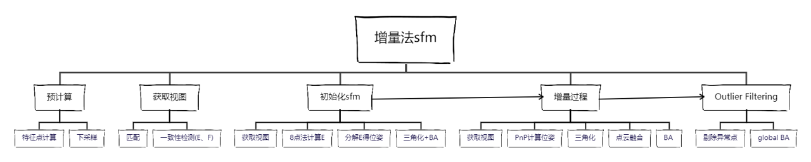
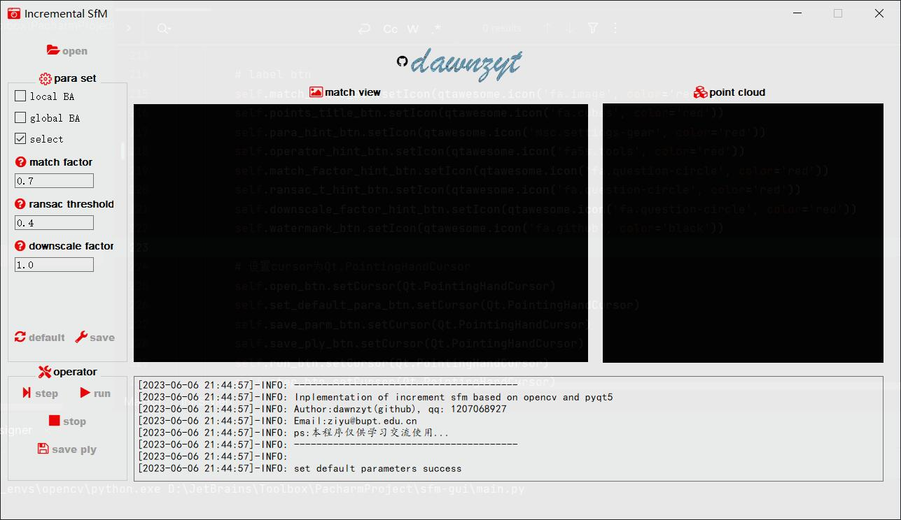

# incremental-sfm
a simple implementation of incremental sfm, please install related packages in requirements.txt and excute:
```bash
pip install PyOpenGL
```

## sfm algorithm
the flowchart of the sfm is as follows.


## introduction
I have implemented the custom sfm algorithm into PyQt, run `main.py`, then you can see a simple operation interface.

- `open` : open a image folder, the images should be named as `1.jpg, 2.jpg, 3.jpg, ...`, and also you should provide a `K.txt` file, which contains the 3x3 camera intrinsic matrix.
- `default` : set the default parameters.
- `save` : save the set parameters.
- `step` : run the sfm algorithm step by step.
- `run` : run the sfm algorithm automatically.
- `stop` : stop the running sfm algorithm.
- `save plt` : save the reconstructed 3d points and camera poses(not implemented yet) as a `.plt` file.
While running the sfm algorithm, you can use the mouse to rotate the 3d points and camera poses.
About the details of the algorithm, you can refer to the `./doc/report.pdf` file.

## attention
I will keep updating this project, if you have any questions, please contact me by email: `ziyu@bupt.edu.cn`.
